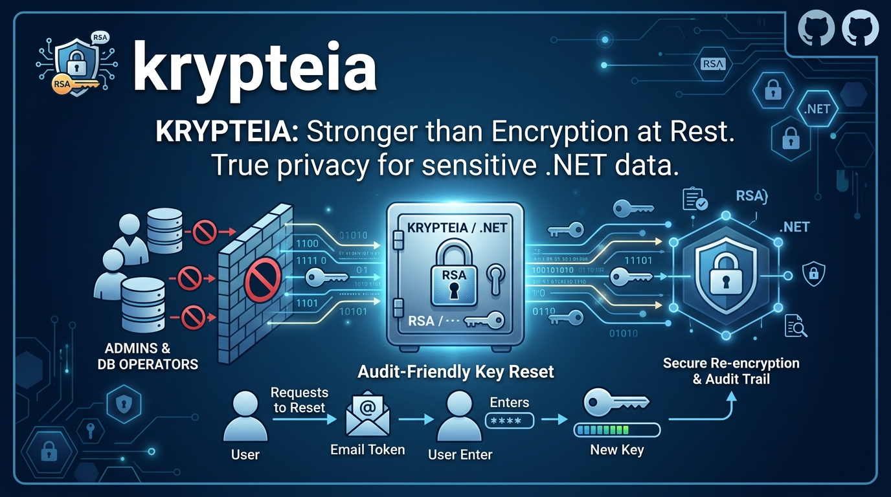

<div align="center">



</div>

<br/>

> Zero-knowledge encryption for .NET with user-recoverable keys.

[](https://github.com/isureshsubramanian/Krypteia/actions)
[](https://www.nuget.org/packages/Krypteia.Core)
[](LICENSE)
[](https://dotnet.microsoft.com/download)

Krypteia is a .NET library for protecting sensitive user data with RSA-based asymmetric encryption. It is designed for applications where **even the application administrators and database operators must not be able to read user data** — a stronger privacy posture than typical "encryption at rest" provides.

The library also solves a practical problem that often blocks adoption of zero-knowledge encryption: **what happens when a user loses their private key?** Krypteia provides a secure, audit-friendly reset flow built around one-time email tokens and automatic data re-encryption.

## Why Krypteia?

Most encryption-at-rest schemes give the database server the keys to decrypt the data. A compromised database — or a curious DBA — can read everything. Krypteia takes a different approach:

- **Private keys live with the user**, not on the server
- The server stores only **public keys** (used to encrypt) and **encrypted backups** of private keys
- Even with full database access, an attacker cannot decrypt user data without also compromising a key vault
- When a user loses their private key, an email-verified reset flow generates a new key pair and re-encrypts the user's existing data

## Key features

- 🔒 **RSA-2048 with OAEP-SHA256** — NIST-recommended defaults, no custom crypto
- 🔑 **User-controlled keys** — private keys never stored on the server in plaintext
- 📧 **Secure reset flow** — email-verified, one-time tokens with configurable TTL
- 📋 **Audit-ready** — structured logs for every operation, designed for CMMC Level 2 / HIPAA / PCI-DSS
- 🧩 **Composable** — install only the packages you need (`Core`, `KeyReset`, `AspNetCore`, `EntityFrameworkCore`)
- ⚡ **Modern .NET** — built for .NET 10 LTS, uses native `System.Security.Cryptography` primitives

## Installation

```bash
dotnet add package Krypteia.Core
dotnet add package Krypteia.AspNetCore        # optional: ASP.NET Core DI helpers
dotnet add package Krypteia.KeyReset          # optional: private key reset flow
dotnet add package Krypteia.Audit             # optional: audit logging
dotnet add package Krypteia.EntityFrameworkCore # optional: EF Core integration
```

## Quick start

```csharp
using Krypteia;
using Krypteia.Abstractions;

// Generate a key pair for a user
KeyPair keys = RsaKeyPairGenerator.Generate();

// Server-side: store the public key only
await keyManagementService.StorePublicKeyAsync(userId, keys.PublicKey);

// Client-side: store the private key securely (keychain, secure storage, etc.)
SaveOnUserDevice(keys.PrivateKey);

// Encrypt sensitive data using the user's public key
var encryption = new RsaEncryptionService();
string ciphertext = await encryption.EncryptAsync("SSN: 123-45-6789", keys.PublicKey);

// Later, decrypt using the user's private key
string plaintext = await encryption.DecryptAsync(ciphertext, keys.PrivateKey);
```

See the [samples folder](samples) for a complete ASP.NET Core Web API example.

## Compliance posture

Krypteia is designed to be **compatible** with major compliance frameworks. The library itself cannot certify your organization — compliance always rests with the operator — but Krypteia provides the cryptographic and audit primitives most frameworks require.

| Framework | What Krypteia provides |
|---|---|
| CMMC Level 2 | Audit log schema, NIST-approved crypto, key management plumbing |
| HIPAA | Technical Safeguards (encryption + audit controls) |
| PCI-DSS 4.0 | Strong cryptography (Req 3.5, 3.6) |
| GDPR | Right-to-erasure via key destruction |
| SOC 2 Type II | Audit logging supports CC6.1, CC6.7 |

See [`docs/COMPLIANCE-CMMC.md`](docs/COMPLIANCE-CMMC.md) for the detailed CMMC Level 2 control mapping.

## Security

Found a vulnerability? Please **do not** open a public issue. See [SECURITY.md](SECURITY.md) for the disclosure process.

## Contributing

Contributions are welcome. Please read [CONTRIBUTING.md](CONTRIBUTING.md) before opening a pull request, and review the [Code of Conduct](CODE_OF_CONDUCT.md).

## License

Released under the [MIT License](LICENSE).

## Disclaimer

Cryptographic libraries carry real risk if misused. Read the documentation carefully, test thoroughly, and consider an independent security review before deploying to production. The Krypteia maintainers provide this library AS IS, without warranty of any kind.
